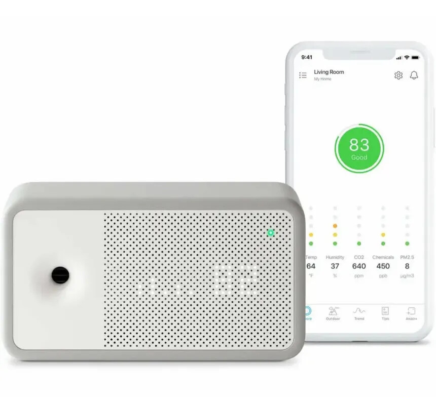
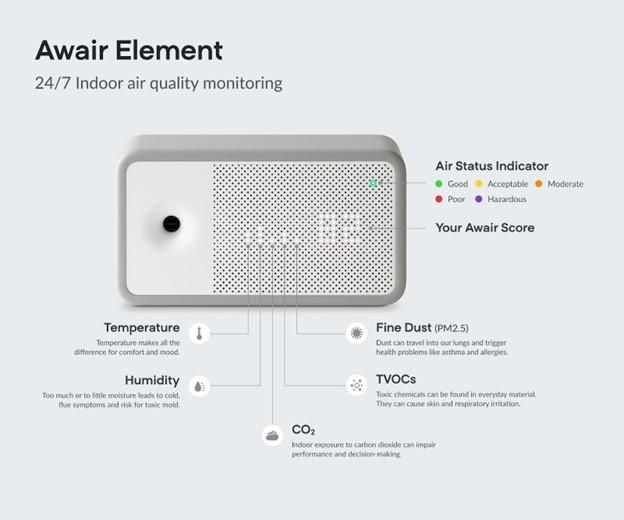
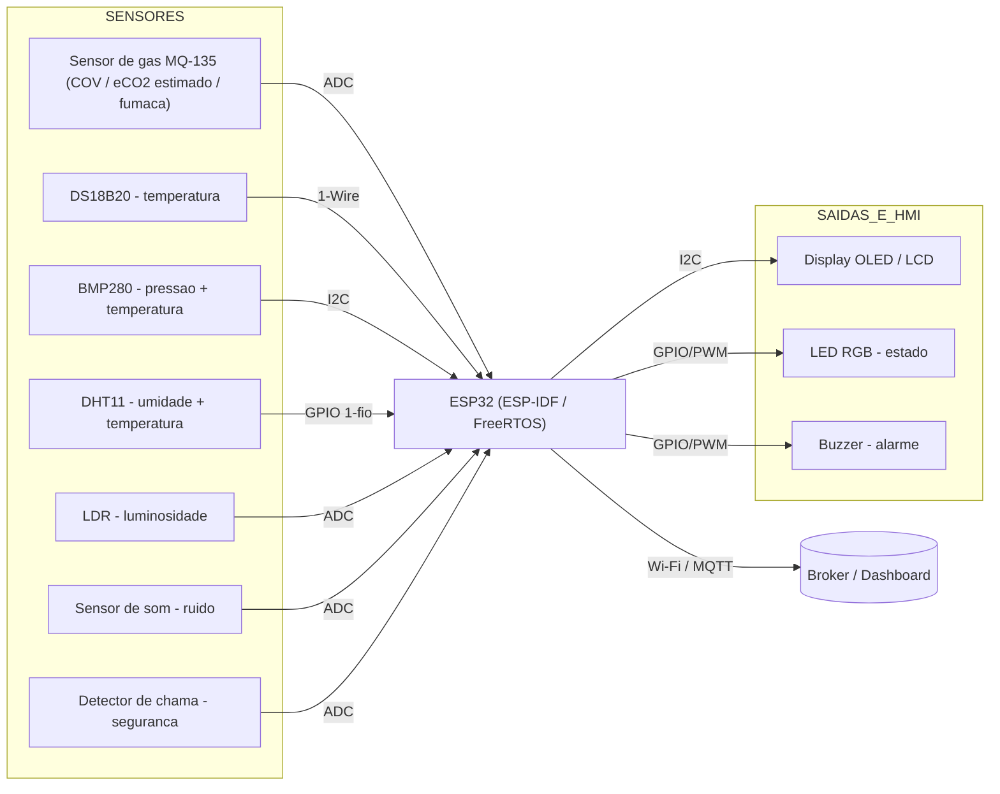

# Monitor de Qualidade do Ar Interno

## Integrantes do grupo

| Nome completo | Matrícula |
| ------------- | --------- |
| *Gabriel Lopes de Amorim*   | *231012129* |
| *Luiz Henrique Guimarães Soares*   | *222022144* |
| *Samara Letícia Alves dos Santos* | *221008445* |
| *Sunamita Vitória Rodrigues Dos Santos*   | *221008697* |

**Foto do produto:**

---

## 1. Descrição do produto selecionado

O produto escolhido é o **Awair Element**, um monitor de qualidade do ar interno (*Indoor Air Quality Monitor* — IAQ) de uso residencial e corporativo ([Awair — especificações oficiais dos sensores](https://support.getawair.com/hc/en-us/articles/360060843933-Technical-Accuracy-of-Awair-Element-Sensors)). Ele mede continuamente parâmetros do ar de um ambiente fechado, consolida-os em um índice de qualidade do ar (0–100), o *Awair Score*, e disponibiliza os dados em aplicativo via Wi-Fi.

O Awair Element foi escolhido por ser um monitor de IAQ bem documentado e multissensor, cujas modalidades de medição (gás, material particulado, temperatura e umidade) se mapeiam bem no ecossistema da ESP32.

### Funções principais

- Medição de material particulado (PM2.5), CO₂ (NDIR), compostos orgânicos voláteis (COV/TVOC), temperatura e umidade.
- Cálculo de um índice consolidado (*Awair Score*).
- Exibição local por LEDs/visor e detalhamento por aplicativo (histórico e tendências).
- Integração com assistentes e automação residencial.

### Público-alvo e contexto de uso

Famílias com preocupações respiratórias (asma, alergias), *home offices*, escritórios, escolas e creches. O contexto é o ambiente *indoor*, onde, segundo a [US EPA](https://www.epa.gov/indoor-air-quality-iaq), a poluição pode ser de 2 a 5 vezes maior que a externa, justificando o monitoramento contínuo.

### Componentes e sensores utilizados (Awair Element)

Conforme a [documentação técnica oficial](https://support.getawair.com/hc/en-us/articles/360060843933-Technical-Accuracy-of-Awair-Element-Sensors):

- CO₂: Amphenol-Telaire T6703 — sensor NDIR (infravermelho não dispersivo); faixa 400–5.000 ppm; precisão ±75 ppm ou 10%. Mede CO₂ real e de forma dedicada.
- COV/TVOC: Sensirion SGP30 — sensor de óxido metálico (MOX) multi-pixel; faixa 20–36.000 ppb; precisão ±15%.
- Material particulado (PM2.5): Honeywell HPMA115S0 — sensor a laser por espalhamento de luz; faixa 0–1.000 µg/m³; precisão ±15 µg/m³ ou 15%.
- Temperatura e umidade: Sensirion SHT31 — sensor CMOS; ±0,2 °C e ±2% UR.
- Microcontrolador com rádio Wi-Fi 2,4 GHz, alimentado por USB.

### Tecnologias de comunicação e controle embarcadas

- Conectividade Wi-Fi 2,4 GHz.
- Telemetria à nuvem com protocolo leve de IoT (*publish/subscribe*, tipicamente MQTT — [mqtt.org](https://mqtt.org)).
- *Firmware* embarcado com escalonamento de tarefas (RTOS) para aquisição, índice e rede.

---

## 2. Análise técnica do funcionamento

### Principais módulos do sistema

| Módulo | Função | Referência |
| ------ | ------ | ---------- |
| **Sensores** | Aquisição dos parâmetros (PM2.5, COV, CO₂, T, UR). Saídas analógicas e barramentos digitais. | [Awair — sensores](https://support.getawair.com/hc/en-us/articles/360060843933-Technical-Accuracy-of-Awair-Element-Sensors) |
| **Controle/Processamento** | Microcontrolador lê os sensores, aplica calibração/compensação e calcula o índice. | [ESP-IDF](https://docs.espressif.com/projects/esp-idf/en/latest/) |
| **Interface (HMI)** | Visor/LEDs com código de cores indicando o estado do ar. | — |
| **Conectividade** | Rádio Wi-Fi + pilha TCP/IP + MQTT para telemetria e app. | [Carneiro da Cunha & Macêdo Batista, 2022](https://journals-sol.sbc.org.br/index.php/reic/article/view/2221) |
| **Energia** | Alimentação USB com regulação; em nós a bateria, técnicas de baixo consumo. | [Lingaraj et al., 2025](https://www.nature.com/articles/s41598-025-19748-3) |

### Identificação de tecnologias críticas

- **Sensor de COV por óxido metálico (MOX):** o Awair usa o SGP30 (MOX) para medir COV — a variação de resistência de um óxido metálico aquecido conforme os gases do ambiente. É a mesma família do sensor que usamos na reprodução, o MQ-135 ([fundamentação — Adão et al., 2026](https://v3.cadernoscajuina.pro.br/index.php/revista/article/view/2858)).
- **Medição de CO₂ por NDIR:** o Awair usa um sensor óptico dedicado (T6703) que mede CO₂ real pela absorção de luz infravermelha. É uma tecnologia crítica do produto que a nossa reprodução não replica (ver *Limitações*).
- **Material particulado por espalhamento de luz:** contagem de partículas iluminadas por feixe óptico (Honeywell HPMA115S0).
- **Protocolos sem fio e MQTT:** telemetria eficiente para dispositivos com recursos limitados ([Carneiro da Cunha & Macêdo Batista, 2022](https://journals-sol.sbc.org.br/index.php/reic/article/view/2221)).
- **RTOS e calibração:** escalonamento de tarefas ([FreeRTOS no ESP-IDF](https://docs.espressif.com/projects/esp-idf/en/latest/esp32/api-reference/system/freertos_idf.html)) e correção de *drift*/temperatura dos sensores de baixo custo ([Silva et al., 2026](https://periodicoscientificos.ufmt.br/ojs/index.php/eng/article/view/21055)).
- **Economia de energia:** modos de baixo consumo (*deep sleep*) e roteamento eficiente em redes de sensores ([Lingaraj et al., 2025](https://www.nature.com/articles/s41598-025-19748-3)).

---

## 3. Proposta de implementação com ESP32 (medidor completo)

A **ESP32** integra Wi-Fi e BLE, múltiplos ADC/I²C/GPIO e roda FreeRTOS no ESP-IDF ([documentação Espressif](https://docs.espressif.com/projects/esp-idf/en/latest/)), reproduzindo os módulos do Awair. Para entregar um medidor completo, a proposta vai além dos 5 parâmetros do Awair, incorporando sensores de ruído, luminosidade, detecção de chama e pressão.

### Mapeamento funcional completo

| Parâmetro / função                             | Componente                        | Interface                    | Equivalência ao Awair                                                                                                    |
| ---------------------------------------------- | --------------------------------- | ---------------------------- | ------------------------------------------------------------------------------------------------------------------------ |
| COV / TVOC como núcleo, eCO₂ estimado e fumaça | MQ-135                            | ADC                          | Equivalente aos COVs medidos por sensor MOX, como o SGP30. O CO₂ é apenas estimado, enquanto o Awair utiliza sensor NDIR |
| Temperatura de alta precisão                   | DS18B20                           | 1-Wire                       | Equivalente                                                                                                              |
| Umidade relativa e temperatura                 | DHT11                             | GPIO, comunicação por um fio | Equivalente para umidade relativa                                                                                        |
| Pressão atmosférica e temperatura              | BMP280                            | I²C                          | Recurso adicional para pressão atmosférica e equivalente para temperatura                                                |
| Luminosidade                                   | LDR                               | ADC                          | Recurso adicional relacionado ao conforto ambiental                                                                      |
| Nível de ruído                                 | Sensor de som                     | ADC ou digital               | Recurso adicional relacionado ao conforto ambiental                                                                      |
| Segurança contra fogo                          | Detector de chama                 | ADC ou digital               | Recurso adicional relacionado à segurança                                                                                |
| Exibição das leituras                          | OLED 0,98" ou LCD 16x2 com I²C    | I²C                          | Reproduz a função de exibição de informações                                                                             |
| Índice de estado no formato semáforo           | LED RGB                           | GPIO ou PWM                  | Reproduz a indicação visual do estado da qualidade do ar                                                                 |
| Alarme sonoro                                  | Buzzer passivo                    | GPIO ou PWM                  | Recurso adicional de alerta                                                                                              |
| Telemetria                                     | Wi-Fi da ESP32 com envio por MQTT | TCP/IP                       | Reproduz a comunicação sem fio e o envio de dados                                                                        |
| Controle e escalonamento                       | ESP-IDF com FreeRTOS              | Software                     | Reproduz o controle embarcado e a organização das tarefas                                                                |
| Economia de energia                            | Deep sleep com leitura cíclica    | Software                     | Reproduz estratégias de economia de energia                                                                              |

### Diagrama de blocos conceitual

### Lógica de funcionamento proposta

1. **Aquisição:** uma tarefa lê todos os sensores periodicamente, aplica média móvel e compensação por temperatura.
2. **Avaliação:** classifica o ar em faixas (bom/moderado/ruim), calcula o índice IAQ e define a cor do LED RGB.
3. **HMI:** atualiza o display e aciona o *buzzer* ao ultrapassar limites (gás alto, chama detectada, ruído excessivo).
4. **Rede:** publica via MQTT em tópicos (ex.: `casa/sala/gas`, `casa/sala/ruido`).
5. **Energia:** entre ciclos, *deep sleep* opcional para operação a bateria.

### Limitações e desafios esperados

- **CO₂ não reproduzido fielmente (principal diferença de medição):** o Awair Element mede CO₂ real com um sensor NDIR dedicado (Telaire T6703). O MQ-135 é um sensor de gás MOX e não mede CO₂ diretamente, dele extraímos apenas uma estimativa de eCO₂. Essa técnica é reconhecidamente imprecisa, porque sensores de COV reagem a qualquer composto orgânico no ar (respiração, produtos de limpeza, perfumes), e não apenas ao CO₂. Para medir CO₂ de verdade, seria necessário acrescentar um módulo NDIR (ex.: MH-Z19B, SenseAir S8 ou Sensirion SCD40).
- **Sem material particulado (PM2.5):** o Awair usa um sensor óptico a laser (Honeywell HPMA115S0); não há equivalente de baixo custo na proposta (ex.: PMS5003). É a segunda lacuna frente ao Awair.
- **Baixa precisão do DHT11:** umidade ≈ ±5% UR, temperatura ≈ ±2 °C, faixa estreita (0–50 °C; 20–90% UR) e amostragem lenta (≈ 1 leitura por segundo). Pode ser substituído por DHT22/AM2302, AHT20 ou SHT3x para mais precisão.
- **BMP280 não mede umidade e pode autoaquecer:** por isso a umidade vem do DHT11; em operação contínua o BMP280 pode registrar temperatura ligeiramente acima do ambiente, daí o uso do DS18B20 como referência.
- **Precisão geral:** leituras adequadas para tendências e demonstração, não para medições de referência.

---

## 4. Pesquisa bibliográfica e tecnológica

### 4.1 Artigos sobre as tecnologias que viabilizam o produto

1. **Sensores de gás de óxido metálico (MOX): do MQ analógico ao digital.**
   ADÃO, F. A. M.; LIMA, E. A. P. de; ALMEIDA, F. P. de; MEDEIROS, J. P. da S.; PAIVA, L. F. R. de; SILVA, L. A. da. *Do analógico ao digital: uma revisão sistemática de sensores de gás óxido metálico para monitoramento de qualidade do ar externo de baixo custo.* **Cadernos Cajuína**, v. 11, n. 6, e2858, 2026. DOI: 10.52641/cadcajv11i6.2858.
   🔗 https://v3.cadernoscajuina.pro.br/index.php/revista/article/view/2858
   **Resumo:** Revisão sistemática (PRISMA, 35 fontes) que compara as gerações analógica da série MQ — incluindo o **MQ-135** — com sensores digitais (SGP41, SCD41), quantificando consumo, *drift*, compensação ambiental e tempo de pré-aquecimento. **Relação com o produto:** a medição de COV por sensor MOX é compartilhada pelo **SGP30 do Awair** e pelo **MQ-135 da reprodução**; o artigo fundamenta tanto essa tecnologia quanto as limitações de calibração que orientam nosso projeto.

2. **Protocolo MQTT para telemetria IoT.**
   CARNEIRO DA CUNHA, B.; MACÊDO BATISTA, D. *Avaliação da Integração do Protocolo MQTT em uma Plataforma de Cidades Inteligentes.* **Revista Eletrônica de Iniciação Científica em Computação (REIC)**, v. 20, n. 2, p. 1–9, 2022. DOI: 10.5753/reic.2022.2221.
   🔗 https://journals-sol.sbc.org.br/index.php/reic/article/view/2221
   **Resumo:** Desenvolve e avalia um adaptador MQTT para a plataforma de cidades inteligentes InterSCity, comparando MQTT e HTTP; observa vazão muito superior com MQTT. **Relação com o produto:** embasa a escolha do MQTT como protocolo de telemetria do monitor sobre o Wi-Fi da ESP32.

3. **Sensores de baixo custo: acurácia, calibração e *drift*.**
   SILVA, C. E. M. da; GENUINO, L. P.; BANDEIRA, E. M. N.; LIMA E SILVA, M.; PESSOA, M. A. da S.; BEZERRA, A. C. V. *Sensores de Baixo Custo para monitoramento da qualidade do ar: Uma Revisão Sistemática para América Latina.* **ES – Engineering and Science**, v. 15, n. 1, 2026. DOI: 10.18607/ES20261521055.
   🔗 https://periodicoscientificos.ufmt.br/ojs/index.php/eng/article/view/21055
   **Resumo:** Revisão sistemática (PRISMA) de sensores de baixo custo (cita MQ-135, BMP280, BME280) que mostra como umidade e temperatura degradam a precisão, tornando a calibração indispensável. **Relação com o produto:** fundamenta as limitações de precisão dos nossos sensores — em especial a fragilidade de **estimar CO₂ a partir de um sensor de gás** frente à medição direta por NDIR.

4. **Eficiência energética em redes de sensores para qualidade do ar.**
   LINGARAJ, K.; MALGHAN, R. L.; KARTHIK RAO, M. C.; GARG, L.; SOMANATH SWAMY, R. H. M.; VISHWANATHA, H. M. *FLPSO-AMPS: an optimized WSN model for air quality monitoring in tier-2 smart cities.* **Scientific Reports**, v. 15, art. 35989, 2025. DOI: 10.1038/s41598-025-19748-3.
   🔗 https://www.nature.com/articles/s41598-025-19748-3
   **Resumo:** Propõe roteamento por lógica *fuzzy* + PSO que reduz consumo de energia, atraso e perda de pacotes em redes de sensores de qualidade do ar. **Relação com o produto:** aborda a tecnologia crítica de **economia de energia**, relevante ao *deep sleep* da ESP32 e ao escalonamento de múltiplos nós.

### 4.2 Artigos sobre aplicação / uso do produto

5. **Monitor de ar aberto baseado em ESP32 (prova de conceito).**
   PINEDA-TOBÓN, D. M.; ESPINOSA-BEDOYA, A.; BRANCH-BEDOYA, J. W. *AQuality32: A low-cost, open-source air quality monitoring device leveraging the ESP32 and Google platform.* **HardwareX**, v. 20, e00607, 2024. DOI: 10.1016/j.ohx.2024.e00607.
   🔗 https://www.sciencedirect.com/science/article/pii/S2468067224001019
   **Resumo:** Documenta hardware, montagem, programação e calibração de um monitor de qualidade do ar aberto com ESP32 (SoM), sensores de CO₂ e PM, T/UR, Wi-Fi/BLE e bateria. **Relação com o produto:** prova de conceito direta da arquitetura ESP32 + sensores + conectividade que propomos.

6. **Arquitetura IoT de IAQ com ESP32, MQTT e InfluxDB (estudo de caso).**
   MOTA, A.; SERÔDIO, C.; BRIGA-SÁ, A.; VALENTE, A. *Implementation of an Internet of Things Architecture to Monitor Indoor Air Quality: A Case Study During Sleep Periods.* **Sensors**, v. 25, n. 6, art. 1683, 2025. DOI: 10.3390/s25061683.
   🔗 https://www.mdpi.com/1424-8220/25/6/1683
   **Resumo:** Dispositivo baseado em **ESP32-C6** que mede CO₂ e PM e envia via **MQTT** para um **InfluxDB**, avaliando o efeito da porta do quarto na concentração de CO₂ durante o sono. **Relação com o produto:** uso real do mesmo *stack* (ESP32 + MQTT + base de dados/*dashboard*) proposto.

7. **Motivação de saúde: qualidade do ar interior e Síndrome do Edifício Doente.**
   SANTOS, M.; ALMEIDA, A.; OLIVEIRA, T. *Noções Gerais sobre Qualidade do Ar Interior e Síndroma do Edifício Doente em Contexto Ocupacional.* **Revista Portuguesa de Saúde Ocupacional**, v. 5, p. S41–S49, 2018. DOI: 10.31252/RPSO.12.05.2018.
   🔗 https://www.rpso.pt/nocoes-gerais-qualidade-do-ar-interior-sindroma-do-edificio-doente-contexto-ocupacional/
   **Resumo:** Revisão integrativa que relaciona ventilação inadequada e acúmulo de poluentes (CO₂, COV, PM) a sintomas (irritação, cefaleia, fadiga). **Relação com o produto:** justifica *por que* medir COV, CO₂ e PM em ambientes internos importa para a saúde dos ocupantes.

8. **Monitoramento de ar com IoT e nuvem (aplicação real).**
   LOPES, M. G.; SANTOS, J. R. dos; AMICI, T. T.; CAMUSSO, D.; FERNANDES, C. L. M. *Monitoramento do ar em ambientes climatizados de armazenamento de sementes usando Internet das Coisas e computação em nuvem.* **Revista Brasileira de Mecatrônica**, v. 4, n. 4, p. 20–47, 2022.
   🔗 https://revistabrmecatronica.sp.senai.br/ojs/index.php/revistabrmecatronica/article/view/167
   **Resumo:** Protótipo IoT de baixo custo (ESP8266 + **DHT22**) que monitora temperatura e umidade do ar e envia os dados à nuvem (ThingSpeak). **Relação com o produto:** aplicação real de monitoramento de ar por IoT, análoga à nossa proposta (inclusive pelo uso de um sensor da família DHT, como o nosso DHT11).

---

## 5. Comparativo com produtos similares

O produto estudado (**Awair Element**) é comparado a outros 6 monitores de mercado (gerações e faixas de preço diferentes) e à **reprodução proposta em ESP32**. As especificações foram levantadas nas páginas dos fabricantes e em comparativos especializados (ver [Referências](#referências)).

| Produto | Ano aprox. | CO₂ | PM2.5 | COV | Outros sensores | Conectividade | Display | Alimentação | Preço aprox. (US$) |
| ------- | ---------- | --- | ----- | --- | --------------- | ------------- | ------- | ----------- | ------------------ |
| **Awair Element** *(estudado)* | 2019 | **NDIR (Telaire T6703)** | Sim (laser) | Sim (SGP30) | T, UR (SHT31), luz, ruído | Wi-Fi | LED | USB | ~149 |
| **Airthings View Plus** | 2021 | NDIR | Sim (laser) | Sim | Radônio, T, UR, pressão | Wi-Fi + BLE | e-ink | 6×AA / USB-C | ~299 |
| **IQAir AirVisual Pro** | 2017 | NDIR | Sim (laser) | Não | T, UR + rede outdoor | Wi-Fi | Colorido | Bateria / USB | ~269 |
| **uHoo** | 2018 | NDIR | Sim | Sim | CO, NO₂, O₃, T, UR, pressão | Wi-Fi | Não | USB | ~300 |
| **AirGradient ONE** | 2023 | NDIR (SenseAir) | Sim (Plantower) | Sim (SGP41) | NOx, T, UR | Wi-Fi | OLED | USB | ~130–195 |
| **Aranet4 Home** | 2020 | NDIR | Não | Não | T, UR, pressão | BLE | e-ink | 2×AA (~2 anos) | ~250 |
| **Reprodução ESP32 (esta proposta)** | 2026 | **eCO₂ (estimado, MQ-135)** | Não | Sim (MQ-135) | T (DS18B20), UR (DHT11), pressão (BMP280), **luz, ruído, chama** | Wi-Fi (MQTT) | OLED/LCD | USB | ~15–25 |

**Observações:**
- **Diferença principal de medição:** ao contrário do Awair, que mede **CO₂ real com NDIR dedicado** (T6703), a reprodução apenas **estima** o eCO₂ a partir do MQ-135. É uma **limitação assumida** em troca do custo muito menor. Note que **todos** os monitores comerciais da tabela usam **NDIR** para CO₂; estimar CO₂ por sensor de gás é típico de soluções de baixíssimo custo.
- **A parte de COV é reproduzida fielmente:** o MQ-135 e o SGP30 do Awair são **ambos sensores MOX**.
- O **AirGradient ONE** é especialmente relevante por ser **open-source e baseado em microcontrolador da família ESP**, ponte natural para a implementação proposta.
- A reprodução **acrescenta luminosidade, ruído e detecção de chama** — em troca das lacunas de **PM2.5** e do **CO₂ por NDIR**. Com o par **BMP280 (pressão) + DHT11 (umidade)** e o **DS18B20 (temperatura)**, cobre os parâmetros ambientais básicos do Awair (T e UR) e ainda adiciona pressão.

---

## Referências

**Produto e contexto**
- Awair Support — *Technical Accuracy of Awair Element Sensors* (lista oficial dos sensores: CO₂ NDIR T6703, COV SGP30, PM Honeywell HPMA115S0, T/UR SHT31). https://support.getawair.com/hc/en-us/articles/360060843933-Technical-Accuracy-of-Awair-Element-Sensors
- Awair Support — *Technical Accuracy of Awair 1st Edition* (confirma sensores dedicados de CO₂, COV e poeira). https://support.getawair.com/hc/en-us/articles/215091837-Technical-Accuracy-of-Awair-1st-Edition
- Teardown independente do Awair Element (confirma o CO₂ NDIR Telaire T6703 e o PM Honeywell). https://medium.com/@erik-kokalj/air-quality-monitor-deep-dive-awair-element-teardown-and-review-3d1d13c3eecd
- US EPA — *Indoor Air Quality (IAQ)*. https://www.epa.gov/indoor-air-quality-iaq
- Comparativos de monitores IAQ. https://www.reviewed.com/home-outdoors/best-right-now/best-indoor-air-quality-monitors ; https://breathesafeair.com/airthings-view-plus-review/

**Plataforma e firmware**
- Espressif — *ESP-IDF Programming Guide*. https://docs.espressif.com/projects/esp-idf/en/latest/
- Espressif — *FreeRTOS (ESP-IDF)*. https://docs.espressif.com/projects/esp-idf/en/latest/esp32/api-reference/system/freertos_idf.html
- MQTT — *MQTT: The Standard for IoT Messaging*. https://mqtt.org

**Sensores e componentes (datasheets)**
- Hanwei Electronics — *MQ-135 Gas Sensor* (datasheet do fabricante).
- Bosch Sensortec — *BMP280 — Digital Pressure Sensor*. https://www.bosch-sensortec.com/products/environmental-sensors/pressure-sensors/bmp280/
- Aosong (ASAIR) — *DHT11 — Temperature and Humidity Sensor*. https://components101.com/sensors/dht11-temperature-sensor
- Analog Devices (Maxim) — *DS18B20 — Programmable Resolution 1-Wire Digital Thermometer*. https://www.analog.com/en/products/ds18b20.html

**Artigos científicos (ver Seção 4 para os resumos)**
- ADÃO, F. A. M. *et al.* **Cadernos Cajuína**, v. 11, n. 6, e2858, 2026. https://v3.cadernoscajuina.pro.br/index.php/revista/article/view/2858
- CARNEIRO DA CUNHA, B.; MACÊDO BATISTA, D. **REIC**, v. 20, n. 2, 2022. https://journals-sol.sbc.org.br/index.php/reic/article/view/2221
- SILVA, C. E. M. da *et al.* **ES – Engineering and Science**, v. 15, n. 1, 2026. https://periodicoscientificos.ufmt.br/ojs/index.php/eng/article/view/21055
- LINGARAJ, K. *et al.* **Scientific Reports**, v. 15, art. 35989, 2025. https://www.nature.com/articles/s41598-025-19748-3
- PINEDA-TOBÓN, D. M. *et al.* **HardwareX**, v. 20, e00607, 2024. https://www.sciencedirect.com/science/article/pii/S2468067224001019
- MOTA, A. *et al.* **Sensors**, v. 25, n. 6, art. 1683, 2025. https://www.mdpi.com/1424-8220/25/6/1683
- SANTOS, M.; ALMEIDA, A.; OLIVEIRA, T. **Revista Portuguesa de Saúde Ocupacional**, v. 5, 2018. https://www.rpso.pt/nocoes-gerais-qualidade-do-ar-interior-sindroma-do-edificio-doente-contexto-ocupacional/
- LOPES, M. G. *et al.* **Revista Brasileira de Mecatrônica**, v. 4, n. 4, 2022. https://revistabrmecatronica.sp.senai.br/ojs/index.php/revistabrmecatronica/article/view/167